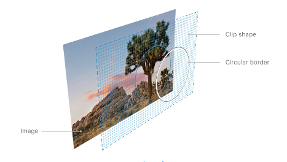

# Chapter 1: SwiftUI Essentials

## A. Creating and Combining Views
### Section 1: Create a New Project and Explore the Canvas
* If the canvas isn’t visible, select Editor > Editor and Canvas to show it.
* By default, SwiftUI view files declare two structures.
    1. The first structure conforms to the View protocol and describes the view’s content and layout.
    
        ```
        struct ContentView: View {
            var body: some View {
                Text("Hello, Karan!").padding()
            }
        }
       ```
    2. The second structure declares a preview for that view.

        ```
        struct ContentView_Previews: PreviewProvider {
            static var previews: some View {
                ContentView()
            }
        }
        ```
 
### Section 2: Customize the Text View
* You can customize a view’s display by changing your code, or by using the inspector to discover what’s available and to help you write code.
    * In the preview, Command-click the greeting to bring up the structured editing popover, and choose Inspect.
    * Your code is always the source of truth for the view. When you use the inspector to change or remove a modifier, Xcode updates your code immediately to match.
* To customize a SwiftUI view, you call methods called modifiers. Modifiers wrap a view to change its display or other properties. Each modifier returns a new view, so it’s common to chain multiple modifiers, stacked vertically.
```
struct ContentView: View {
    var body: some View {
        Text("Turtle Rock")
            .font(.title)
            .padding()
    }
}
```

### Section 3: Combine Views Using Stacks
* When creating a SwiftUI view, you describe its content, layout, and behavior in the view’s body property; however, the body property only returns a single view.
* You can combine and embed multiple views in stacks, which group views together horizontally, vertically, or back-to-front.
* In this section, you’ll use a vertical stack to place the title above a horizontal stack that contains details about the park.
    * Create VStack
        1. Command-click the text view’s initializer to show the structured editing popover, and then choose Embed in VStack.
        2. Open the library by clicking the plus button (+) at the top-right of the Xcode window, and then drag a Text view to the place in your code immediately after the “Turtle Rock” text view.
        3. Edit the VStack initializer to align the views by their leading edges. (alignment: .leading)
    * Create HStack
        1. In the canvas, Command-click Joshua Tree National Park, and choose Embed in HStack.
        2. Add a new text view after the location
        3. To direct the layout to use the full width of the device, separate the park and the state by adding a Spacer to the horizontal stack holding the two text views.
    * Spacer: A spacer expands to make its containing view use all of the space of its parent view, instead of having its size defined only by its contents.
```
struct ContentView: View {
    var body: some View {
        VStack(alignment: .leading) {
            Text("Turtle Rock")
                .font(.title)
            HStack {
                Text("Joshua Tree National Park")
                    .font(.subheadline)
                Spacer()
                Text("California")
                    .font(.subheadline)
            }
        }
        .padding()
    }
}
```

### Section 4: Create a Custom Image View
* Create a custom view that applies a mask, border, and drop shadow to the image

    1. Add an image to the project’s asset catalog: drag it to the asset catalog editor
    2. Create a custom view: Create a new SwiftUI view for your custom image view. Choose File > New > File to open the template selector again. In the User Interface section, select SwiftUI View and click Next. Name the file CircleImage.swift and click Create.
    3. Apply a mask, border, and drop shadow to an image
        1. Add Image(_:) initializer
        2. Add a call to clipShape(Circle()) to apply the circular clipping shape to the image.
            * The Circle type is a shape that you can use as a mask, or as a view by giving the circle a stroke or fill.
        3. Create another circle with a gray stroke (later white), and then add it as an overlay to give the image a border.
        4. Add a shadow with a 10 point radius.
```
struct CircleImage: View {
    var body: some View {
        Image("turtlerock")
            .clipShape(Circle())
            .overlay(Circle().stroke(Color.white, lineWidth: 4))
            .shadow(radius: 10)
    }
}
```

### Section 5: Use UIKit and SwiftUI Views Together
* To use UIView subclasses from within SwiftUI, you wrap the other view in a SwiftUI view that conforms to the UIViewRepresentable protocol. (SwiftUI includes similar protocols for WatchKit and AppKit views)
* To get started, you’ll create a new custom view that can present an MKMapView.
    1. Choose File > New > File, select iOS as the platform, select the SwiftUI View template, and click Next. Name the new file MapView.swift and click Create.
    2. Add an import statement for MapKit, and declare UIViewRepresentable conformance for the MapView type.
* The UIViewRepresentable protocol has two requirements you need to add: 
    1. a makeUIView(context:) method that creates an MKMapView
        * Replace the body property with a makeUIView(context:) method that creates and returns an empty MKMapView.
    2. an updateUIView(_:context:) method that configures the view and responds to any changes
        * Create an updateUIView(_:context:) method that sets the map view’s region to the correct coordinates to center the map on Turtle Rock.
* When previews are in static mode, they only fully render SwiftUI views. Because MKMapView is a UIView subclass, you’ll need to switch to a live preview to see the map.
    * Click the Live Preview button to switch the preview to live mode. You might need to click the Try Again or Resume button above your preview.
```
import SwiftUI
import MapKit

struct MapView: UIViewRepresentable {
    func makeUIView(context: Context) -> MKMapView {
        MKMapView(frame: .zero)
    }

    func updateUIView(_ uiView: MKMapView, context: Context) {
        let coordinate = CLLocationCoordinate2D(
                    latitude: 34.011286, longitude: -116.166868)
                let span = MKCoordinateSpan(latitudeDelta: 2.0, longitudeDelta: 2.0)
                let region = MKCoordinateRegion(center: coordinate, span: span)
                uiView.setRegion(region, animated: true)
    }
}
```

### Section 6: Compose the Detail View
* In ContentView.swift:
    1. Embed a VStack that holds the three text views in another VStack.
    2. Add your custom MapView to the top of the stack. Set the size of the MapView with frame(width:height:).
        * When you specify only the height parameter, the view automatically sizes to the width of its content. In this case, MapView expands to fill the available space.
        * Click the Live Preview button to see the rendered map in the composed view.
    3. Add the CircleImage view to the stack
        * To layer the image view on top of the map view, give the image an offset of -130 points vertically, and padding of -130 points from the bottom of the view.
    4. Add a spacer at the bottom of the outer VStack to push the content to the top of the screen.
    5. Finally, to allow the map content to extend to the top edge of the screen, add the edgesIgnoringSafeArea(.top) modifier to the map view.

Questions:
1. When creating a custom SwiftUI view, where do you declare the view’s layout?
    1. In the view’s initializer.
    2. In the body property.
    3. In the layoutSubviews() method.
2. Which layout renders from the following view code?
    ```
    var body: some View {
        HStack {
            CircleImage()
            VStack(alignment: .leading) {
                Text("Turtle Rock")
                    .font(.title)
                Text("Joshua Tree National Park")
            }
        }
    }
    ```
   
3. Which of these is a correct way to return three views from a custom view’s `body` property?
    ```
   VStack {
      Text("Turtle Rock")
         .font(.title)
      Divider()
      Text("Joshua Tree National Park")
   }
    ```
    ```
   [
       Text("Turtle Rock").font(.title),
       Divider(),
       Text("Joshua Tree National Park")
   ]
    ```
    ```
   Text("Turtle Rock")
       + Divider()
       + Text("Joshua Tree National Park")
   ```
4. Which is the correct way to use modifier methods to configure a view?
    ```
   var text = Text("Hello world!")
   text.font(.title)
   text.foregroundColor(.purple)
   return text
    ```
    ```   
   var text = Text("Hello world!")
   text.font = .title
   text.foregroundColor = .purple
   return text
    ```
    ```
   Text("Hello world!")
      .font(.title)
      .foregroundColor(.purple)
   ```

Answers:
1. In the body property: Custom views implement the body property, which is a requirement of the View protocol.
2. 3rd image: The nested horizontal and vertical stacks arrange the image to the left of the two text views.
3. 1st snippet: You can use a stack to return multiple views from a body property.
4. 3rd snippet: A modifier returns a view that applies a new behavior or visual change. You can chain multiple modifiers to achieve the effects you need.
